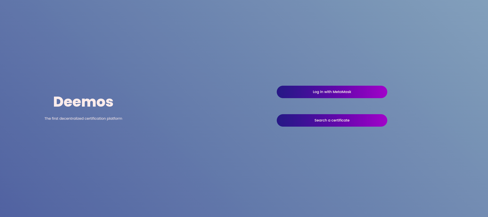

# Deemos - Starton Hackaton

  

## Problem

With the web3 revolution seemingly inevitable, web2 services and applications will undoubtedly have to transition to a new world. A world based on concepts such as decentralization, privacy, and data anonymization.

However, some principles of web2 services that seem to be in contradiction with web3 will have to remain. For example: it is necessary to be able to verify the age of a user to authorize him to access gambling platforms. In web2, groups ask for official documents to verify our identity. They also allow themselves to keep the rest of the non-necessary information that they will sell at a high price. But how to verify the age or any other information of a person in the web3 if everyone is anonymous?

## Solution

That's where Deemos comes in, offering to let you prove a personal information without disclosing it. Deemos is a platform that generates a NTT token with your identity card to prove your age and nationality.

With the open-source code you can be sure that Deemos does not keep any information about you. You will just have to provide this token to the applications requesting it. This way, you could attest your condition without disclosing the rest of your personal information.

## Installation

No installation needed. It is already running [deemoos](http://deemos.tech/)

## Team & Feedbacks

Our team is "Deemos x PoC". Thanks to this hackaton we discovered the technology of Starton.
This hackaton was a very good discovery of this technology.

## How to Use

| [ Lucas Louis](https://github.com/lucas-louis) | [ Abdelkarim Bengrine](https://github.com/AbdelkarimBENGRINE) | [ Amoz Pay](https://github.com/AmozPay) | 
| :---: | :---: | :---: |
